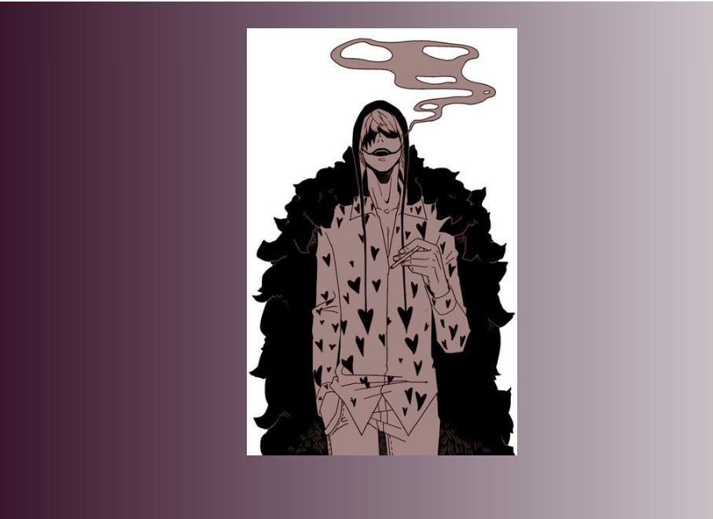
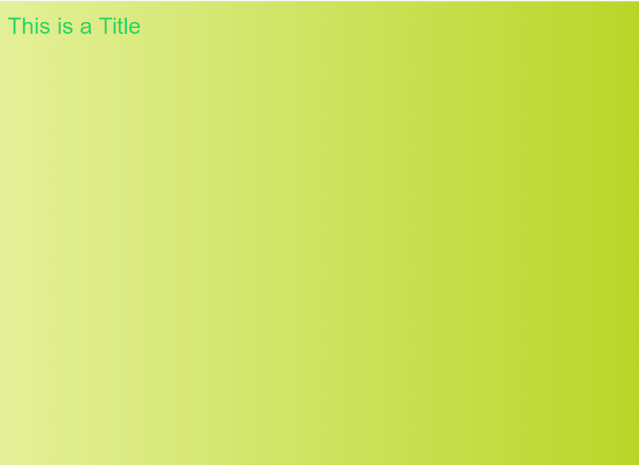
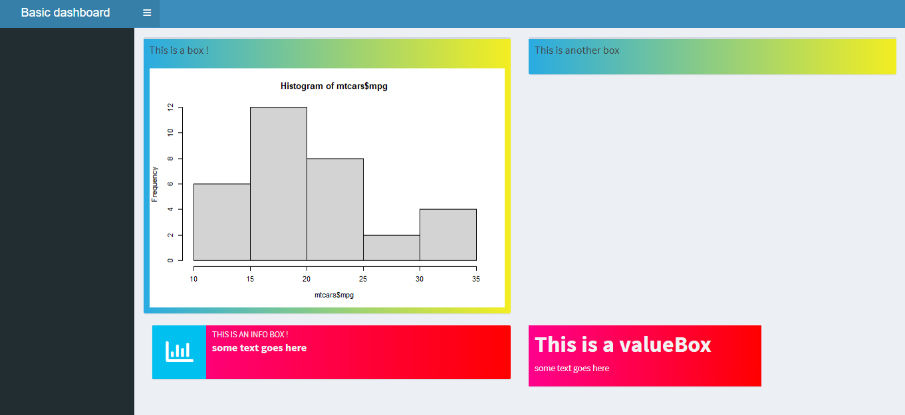

<!-- README.md is generated from README.Rmd. Please edit that file -->

# corazon

<!-- badges: start -->

[](https://cran.r-project.org/package=corazon)

[](https://cran.r-project.org/package=corazon)

[](https://cran.r-project.org/package=corazon)

[](https://cran.r-project.org/package=corazon)

[](https://choosealicense.com/licenses/mit/)

[](https://travis-ci.com/feddelegrand7/corazon)

[](https://github.com/feddelegrand7/corazon)

<!-- badges: end -->

`corazon` allows you to incorporate easily
[colorffy](https://www.colorffy.com/gradients/catalog) gradient colors
within Shiny elements though it is principally designed for the app’s
body.




## Installation

You can install the `corazon` package from CRAN with:

``` r

install.packages("corazon")
```

You can install the development version of `corazon` from Github with:

``` r

install.packages("remotes")  # If not installed 

remotes::install_github("feddelegrand7/corazon")
```

## Examples

# IMPORTANT: The gradients won’t be applied if you leave your shiny application empty \!\!\!

By default `corazon` applies the color gradient on the body of your
shiny app:

``` r
library(shiny)
library(corazon)

ui <- fluidPage(

corazon_gradient(colorName = "PINEAPPLE", txtColor = "#1ED760"),

h1("This is a Title"),

)

server <- function(input, output) {}

shinyApp(ui = ui, server = server)
```



How do you find the gradient colors’ names ?

  - You can run `available_gradients()`: this will return a data frame
    of the available gradient colors’ names along with their respective
    hex codes.

  - You can visit the
    [colorffy](https://www.colorffy.com/gradients/catalog) website where
    you can find a catalog of the gradient colors. Just copy the names
    and paste them within the `corazon_gradient()` function.

You can incorporate gradients within many (not all) shiny element. You
just need to prefix the shiny element’s Id with a `#`:

``` r
library(shiny)
library(corazon)

ui <- fluidPage(
corazon_gradient(colorName = "LOVE"),
corazon_gradient(element = "#txt", colorName = "PEACH", txtColor = "#4E5C68"),
corazon_gradient(element = "#txt2", colorName = "ROYAL", txtColor = "#4E5C68"), 
corazon_gradient(element = "#btn", colorName = "COOL", txtColor = "#4E5C68"), 
corazon_gradient(element = "#dbtn", colorName = "JUICE", txtColor = "#4E5C68"),
corazon_gradient(element = "#ninp", colorName = "CYBER", txtColor = "#4E5C68"),
corazon_gradient(element = "#date", colorName = "MELOCOTON", txtColor = "#4E5C68"),
corazon_gradient(element = "#navbar", colorName = "LANDSCAPE", txtColor = "#4E5C68"),


h1("This is a Title"),

textAreaInput(inputId = "txt", 
              label = "This is textAreaInput ",
              height = "300px",
              width = "300px"),

textInput(inputId = "txt2", label = "This is a textInput"), 

actionButton(inputId = "btn", label = "this is an actionButton"), 

downloadButton(outputId = "dbtn", label = "This is a downloadButton"),

br(), br(),

numericInput(inputId = "ninp", label = "This is a numericInput", 
             min = 0, max = 100, value = 10, step = 1), br(), 

shiny::dateInput(inputId = "date", label = "This is a dateInput"), 


)

server <- function(input, output) {}

shinyApp(ui = ui, server = server)
```


You can also use `corazon` in other shiny packages. In this example, we
applied color gradients into some `shinydashboard` elements using their
classes:

``` r

library(shinydashboard)
library(corazon)

ui <- dashboardPage(
  
  
  dashboardHeader(title = "Basic dashboard"),
  dashboardSidebar(),
  dashboardBody(  
    corazon_gradient(element = ".box", colorName = "HUMMINGBIRD"),
    corazon_gradient(element = ".info-box", colorName = "VALENTINE'SDAY"),
    corazon_gradient(element = ".inner", colorName = "VALENTINE'SDAY"),
    fluidRow(
      box(title = "This is a box !", 
          width = 6, 
          plotOutput(outputId = "plot1")
        ),

      box(
        title = "This is another box", 
        width = 6
      )
    ), 
    
    infoBox(
      title = "This is an info box ! ", 
      value = "some text goes here", 
      width = 6),
    
    valueBox("This is a valueBox", subtitle = "some text goes here")
  )
)

server <- function(input, output) {
  
  output$plot1 <- renderPlot({
    
    hist(mtcars$mpg)
    
  })
}

shinyApp(ui, server)
```



## Code of Conduct

Please note that the `corazon` project is released with a [Contributor
Code of
Conduct](https://contributor-covenant.org/version/2/0/CODE_OF_CONDUCT.html)
and made with ❤️. By contributing to this project, you agree to abide by
its terms.
