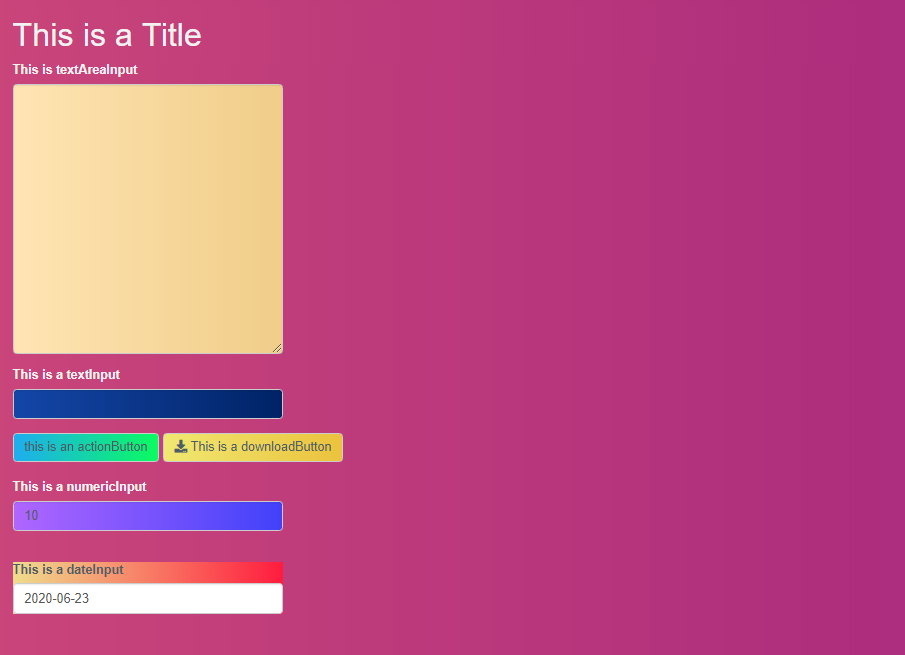

```{r, include = FALSE}
knitr::opts_chunk$set(
  collapse = TRUE,
  comment = "#>"
)
```


# corazon

`corazon` allows you to incorporate easily [colorffy](https://www.colorffy.com/gradients/catalog) gradient colors within Shiny elements. 


## Installation

You can install the `corazon` package from CRAN with: 

```{r, eval=FALSE}

install.packages("corazon")

```

You can install the development version of `corazon` from Github with: 

```{r, eval=FALSE}

install.packages("remotes")  # If not installed 

remotes::install_github("feddelegrand7/corazon")


```


## Examples

By default `corazon` applies the color gradient on the body of your shiny app: 

```{r, eval=FALSE}
library(shiny)
library(corazon)

ui <- fluidPage(

corazon_gradient(colorName = "PINEAPPLE", txtColor = "#1ED760"),

h1("This is a Title"),

)

server <- function(input, output) {}

shinyApp(ui = ui, server = server)

```


How do you find the gradient colors' names ? 

+ You can run `available_gradients()`: this will return a data frame of the available gradient colors' names along with their respective hex codes. 

+ You can visit the [colorffy](https://www.colorffy.com/gradients/catalog) website where you can find a catalog of the gradient colors. Just copy the names and paste them within the `corazon_gradient()` function. 


You can incorporate gradients within any shiny element. You just need to prefix the shiny element's Id with a `#` 


```{r, eval=FALSE}
library(shiny)
library(corazon)

ui <- fluidPage(

corazon_gradient(element = "#txt", colorName = "PEACH", txtColor = "#4E5C68"), # don't forget to prefix the id wih the # 

h1("This is a Title"),

textAreaInput(inputId = "txt", label = "This is textAreaInput ", height = "500px", width = "500px")


)

server <- function(input, output) {}

shinyApp(ui = ui, server = server)

```





Finally, you can apply different gradients to different shiny elements: 


```{r, eval=FALSE}
library(shiny)
library(corazon)

ui <- fluidPage(

corazon_gradient(colorName = "COOL", txtColor = "white"),  
corazon_gradient(element = "#txt", colorName = "SANGRIA WINE", txtColor = "#4E5C68"),  

h1("This is a Title"),

textAreaInput(inputId = "txt", label = "This is textAreaInput ", height = "500px", width = "500px")


)

server <- function(input, output) {}

shinyApp(ui = ui, server = server)

```


